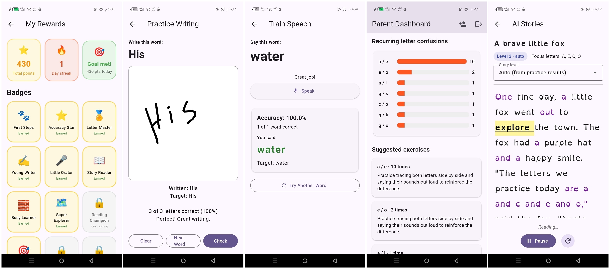

# Verbix 📚

[](LICENSE.md)
[](https://www.android.com/)
[](https://flutter.dev)
[](https://dart.dev)
[](https://firebase.google.com)
[](https://developers.google.com/ml-kit)
[](https://www.android.com/better-phone/)

> **Verbix** is an Android application designed to support children with learning disabilities, particularly dyslexia, which affects an estimated [5-10% of children worldwide](https://pmc.ncbi.nlm.nih.gov/articles/PMC6099274/#:~:text=Given%20that%20an%20estimated%205,and%20informed%20understandings%20of%20dyslexia.). Verbix uses on-device **OCR**, **digital-ink recognition** and **speech recognition** to analyze a child's handwriting and pronunciation, detect recurring letter confusions (for example **b/d**, **e/o**), and generate personalized exercises, stories and rewards that keep learning fun.



---

## Key Features

### 📝 Handwriting Analysis
- Capture handwritten text with the camera and read it with **Google ML Kit Text Recognition**.
- Draw words on a touch pad and read them with **ML Kit Digital Ink Recognition**.
- Instant, color-coded analysis: correct letters, mixed-up letter pairs and **missing letters**.
- Confusion pairs (e.g. `b / d`, `p / q`, `e / o`) are flagged with a targeted practice tip.

### 🗣️ Speech Pattern & Training
- **Speech Pattern** — read a practice paragraph aloud; the app transcribes it and scores it word by word.
- **Train Speech** — say a single target word; every letter is colored green (correct), orange (mixed up) or red (extra), with missing letters listed.
- Detailed analysis cards show exactly which letters the child confuses (e.g. **"e / o"**), plus how many times each mix-up happened.
- English recognition is forced (even on non-English devices) so results are never transcribed in the wrong language.

### ✍️ Interactive Learning
- Practice menu built for young learners: big, colorful tiles and a cheerful, dyslexia-friendly font (**OpenDyslexic**).
- Personalized word sets: shared practice words plus words the child scans from real flashcards or books.

### 📖 AI Storytelling
- Stories generated **on-device** (no network, no API key), always starring an animate hero.
- Reading level adapts to the child's past accuracy (Levels 1–3).
- Weaves in the child's own practice words and gives every trouble letter a "letter spotlight" sentence.
- Read-along mode highlights each spoken word, underlines focus letters, and reads one sentence at a time with a dyslexia-friendly pace.

### 👨‍👩‍👧 Parents Dashboard
- Parent accounts link to a child with a simple 6-character code.
- Progress over time via accuracy trend charts, recurring letter-confusion reports, and practice suggestions.

### 🎮 Gamification
- **Points** for every completed exercise (base + accuracy bonus).
- 15 unlockable **badges** (First Steps, Accuracy Star, Little Orator, Story Reader, streak badges…).
- **Streaks** 🔥, **daily goals** 🎯 and a dedicated **My Rewards** screen with points, streak and goal ring.
- Progress is mirrored locally (SharedPreferences) and synced to Firestore, so rewards keep working even offline or before rules are published.

### 🃏 Flashcard Recognition
- Point the camera at flashcards, books, or any printed text.
- OCR extracts the words and adds them to the child's custom practice set automatically.

---

## Tech Stack

| Area | Technology |
|---|---|
| Language | **Dart 3** (Flutter) |
| Frontend | Flutter with **Material 3**, custom kid-friendly UI |
| Auth & Data | **Firebase Authentication** + **Cloud Firestore** |
| OCR | **Google ML Kit** — Text Recognition |
| Handwriting | **Google ML Kit** — Digital Ink Recognition |
| Speech | `speech_to_text` (Android SpeechRecognizer) |
| Reading | `flutter_tts` + **OpenDyslexic** font |
| Local cache/gamification | `shared_preferences` |

---

## Getting Started

### Prerequisites
- Flutter SDK (3.x) installed and on your PATH.
- An Android device/emulator with **Google app / Android Speech Services** installed for speech exercises.
- A Firebase project (Auth email/password + Firestore) — drop your own `google-services.json` into `android/app/`.

### Firestore shape
```
practicepara/words               -> shared practice words
practicepara/speechpat           -> speech paragraphs
users/{uid}                      -> { role, email, linkCode, childIds, parentIds }
users/{uid}/sessions/{id}        -> { type, accuracy, correctWords, totalWords, confusions, timestamp }
users/{uid}/profile/gamification -> { points, todayPoints, dailyGoal, streak, ..., badges }
users/{uid}/customWords/{id}     -> words added by flashcard scanning
```

### Run the app
```bash
flutter pub get
flutter run
```

### Build an APK
```bash
flutter build apk --debug
# APK output: build/app/outputs/flutter-apk/app-debug.apk
```

### Publish Firestore rules
The repo ships `firestore.rules` plus `firebase.json` / `.firebaserc`:
```bash
firebase login
firebase deploy --only firestore:rules
```

---

## Usage

### *Writing Pattern*
1. Open **Writing Pattern** → read the shown paragraph.
2. Write it on a page (a marker works best).
3. Point the camera at your handwriting and capture.
4. Review the color-coded letter analysis, confusion pairs and suggestions.

### *Practice Writing*
1. Open **Practice Writing** → draw the shown word on the touch pad.
2. Get instant accuracy and letter-by-letter feedback.

### *Speech Pattern*
1. Open **Speech Pattern** → read the practice paragraph aloud (press **Start Speaking**).
2. Review the accuracy, mixed-up letter pairs and missing letters.

### *Train Speech*
1. Open **Train Speech** → press **Speak** and say the target word.
2. See green/orange/red letter feedback with confusions + missing letters.

### *AI Storytelling*
1. Open **AI Stories** → pick a level or use **Auto**.
2. Press **Read aloud** to follow the highlight and listen.
3. Finishing a story earns points and unlocks badges.

### *Rewards*
1. Open **My Rewards** → see total points, streak, today's goal progress and the badge wall.
2. Earn points and badges by completing exercises and keeping streaks.

### *Parents Dashboard*
1. Sign up as a **Parent** and enter the child's **My Link Code**.
2. Monitor accuracy trends and recurring letter confusions.

### *Flashcard Recognition*
1. Open **Flashcard Recognition** → point the camera at a card or book page.
2. Words are recognized and added to the child's practice words.

---

## Project Structure

```
lib/
├── main.dart                      # App entry point
├── screens/
│   ├── splash_screen.dart         # Boot + Firebase init
│   ├── login_screen.dart          # Sign in / register (parent or child)
│   ├── home_screen.dart           # Role router + child practice menu
│   ├── writing_pattern_screen.dart# Handwriting OCR analysis + camera
│   ├── practice_writing_screen.dart# Touch digital-ink practice
│   ├── speech_pattern_screen.dart # Paragraph reading analysis
│   ├── train_speech_screen.dart   # Single-word speech training
│   ├── story_screen.dart          # AI stories + read-along
│   ├── rewards_screen.dart        # Points, streak, badges
│   ├── parent_dashboard_screen.dart# Parent progress view
│   ├── link_child_screen.dart     # Link parent <-> child by code
│   └── flashcard_scan_screen.dart # OCR flashcards into practice words
├── services/
│   ├── letter_analysis.dart       # Word/letter comparison + confusions
│   ├── session_service.dart       # Session history (Firestore)
│   ├── speech_service.dart        # Shared speech-engine wrapper
│   ├── story_generator.dart       # On-device story generation
│   ├── gamification_service.dart  # Points/badges/streaks (Firestore + local)
│   ├── user_service.dart          # Roles + parent-child linking
│   └── practice_words_service.dart# Custom practice word sets
└── widgets/
    ├── kid_feedback.dart          # Badge dialog / points snackbar
    ├── accuracy_trend_chart.dart  # Dashboard trend chart
    └── confusion_bar_list.dart    # Recurring confusion list
```

---

## Roadmap

- [x] Handwriting analysis (OCR + digital ink)
- [x] Speech pattern recognition + speech training
- [x] AI storytelling with read-along
- [x] Parents dashboard with progress analytics
- [x] Gamification (points, badges, streaks, daily goals)
- [x] Flashcard recognition
- [x] User profiles + parent-child linking
- [ ] In-app dyslexia screening assessment (future)
- [ ] Offline support
- [ ] Cloud sync beyond sessions/gamification
- [ ] Multi-language support

---

## Acknowledgments

- Google ML Kit for OCR and handwriting recognition.
- Google Speech Services for on-device speech recognition.
- Firebase for authentication and real-time data.
- The OpenDyslexic typeface (SIL OFL 1.1) for dyslexia-friendly reading.

## Contributing

This is a portfolio project and is not open for contributions. However, feedback and suggestions for improving learning accessibility are welcome!

## License

Copyright © 2024 Swati Sharma. All rights reserved.
See [LICENSE](LICENSE) for details.